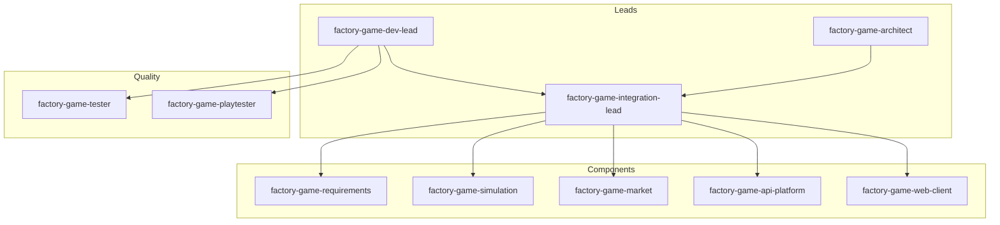

# FactoryGame -- team (subagents)

This document describes **roles** for delegation in Cursor (Task / background agents). The game is split into **components** (specialists) and **leads** (integration and architecture).

## Organization

| Type | Agent | When |
|-----|-------|-----|
| **Lead** | `factory-game-integration-lead` | Feature spans sim/API/web/exchange; DTO parity; "API OK but UI wrong" |
| **Lead** | `factory-game-architect` | Large refactor; security/determinism/economy review (readonly) |
| **Lead** | `factory-game-dev-lead` | Local dev loop, balance, backlog |
| **Component** | `factory-game-requirements` | KRAVSPEC, scope, terminology |
| **Component** | `factory-game-simulation` | Tick, machines, DNA, sorters |
| **Component** | `factory-game-market` | Exchange, pool, wallet, transactions |
| **Component** | `factory-game-api-platform` | Endpoints, EF, Infrastructure, Contracts |
| **Component** | `factory-game-web-client` | Blazor, canvas, **desktop game shell**, offline, wiki UI |
| **Quality** | `factory-game-tester` | xUnit Domain/Api |
| **Quality** | `factory-game-playtester` | MCP against API, requirements parity |

**Operations:** The repo owner verifies in **Azure** -- see `.cursor/rules/factory-game-team.mdc`. The agent runs `dotnet build` / `dotnet test` in Cursor. `@factory-game-azure-test`.

---

## When you delegate

1. **One component** -> matching specialist subagent + `@factory-game-*` skill.
2. **Two or more layers** -> `factory-game-integration-lead` first; it delegates further.
3. **Large or risky change** -> `factory-game-architect` (readonly), then integration or specialist.
4. Specify **readonly** for exploration/review.
5. Attach `KRAVSPEC.md`, relevant `.cs` files, or `.cursor/skills/...`.

---

## Components (specialists)

### Requirements & game design -- `factory-game-requirements`

- **Skill:** `factory-game-krav-arkitektur`
- **Owns:** `KRAVSPEC.md`, product boundaries, acceptance criteria
- **Prompt:** Read `KRAVSPEC.md`. [Question.] Update requirements only if the user asked; otherwise gap + which specialist should implement.

### Simulation -- `factory-game-simulation`

- **Skill:** `factory-game-server-sim`
- **Owns:** `src/FactoryGame.Domain/Simulation/`
- **Prompt:** Implement/review sim per `KRAVSPEC.md` and `@factory-game-server-sim`. Deterministic; no special cases per base-element id.

### Exchange & seaport -- `factory-game-market`

- **Skill:** `factory-game-bors-seaport`
- **Owns:** matching, pool, market and wallet services
- **Prompt:** Exchange/seaport per `KRAVSPEC.md` and `@factory-game-bors-seaport`. Separate matching from factory tick.

### API & platform -- `factory-game-api-platform`

- **Skill:** `factory-game-api-platform`
- **Owns:** `FactoryGame.Api`, `Infrastructure`, `Contracts`
- **Prompt:** Endpoints/persistence/DTO per `@factory-game-api-platform`. Domain rules in Domain, not in the SQL layer.

### Web client -- `factory-game-web-client`

- **Skills:** `factory-game-web-klient`, `factory-game-game-shell` (desktop layout/windows)
- **Owns:** `src/FactoryGame.Web/`
- **Prompt:** Client per `KRAVSPEC.md` and `@factory-game-web-klient`. Desktop shell (toolbar, floating windows, canvas): `@factory-game-game-shell`. Server authoritative; document sync/merge.

---

## Leads

### Integration -- `factory-game-integration-lead`

- **Skill:** `factory-game-integration-lead`
- **Owns:** cross-cutting flows (board start->keyframes, Contracts<->Web<->MCP, economy end-to-end)
- **Prompt:** Coordinate [feature] across layers. Delegate implementation to the right specialist; verify the whole with tests/MCP.

### Architecture -- `factory-game-architect`

- **Skill:** `factory-game-architect`
- **Owns:** readonly review against requirements (security, determinism, economy races, offline)
- **Prompt:** Review [change/PR] against `KRAVSPEC.md`. Critical/Warning/Suggestion + recommended specialist. Do not implement without explicit mandate.

### Dev lead (local loop) -- `factory-game-dev-lead`

- **Skills:** `factory-game-dev-lead`, `factory-game-mcp-playtest`, `factory-game-mcp-server`
- **Prompt:** Run the local loop per `@factory-game-dev-lead`. Delegate xUnit -> `factory-game-tester`, cross-layer fix -> `factory-game-integration-lead`.

---

## Quality & exploration

### Codebase exploration (`scout`)

- **Cursor:** `explore`, `readonly: true`
- **Prompt:** Map where [X] is handled. Return file paths and quotes; no changes.

### Build & CI (`build`)

- **Prompt:** `dotnet build/test` in Cursor. xUnit -> `factory-game-tester`.

### xUnit -- `factory-game-tester`

- **Skill:** `factory-game-tester`
- **Prompt:** `@factory-game-tester`. Meaningful tests; `dotnet test` with filter. Not MCP playtest.

### MCP / Azure -- `factory-game-playtester`

- **Skills:** `factory-game-mcp-server`, `factory-game-mcp-playtest`, `factory-game-azure-test`
- **Prompt:** MCP against Azure; `npm run build/smoke/playtest` in `tools/factorygame-mcp/`. No token in repo.

---

## Skills index

| Skill | Directory |
|-------|---------|
| Requirements & architecture | `.cursor/skills/factory-game-krav-arkitektur/` |
| Server sim | `.cursor/skills/factory-game-server-sim/` |
| Exchange & seaport | `.cursor/skills/factory-game-bors-seaport/` |
| Web client | `.cursor/skills/factory-game-web-klient/` |
| Desktop game shell | `.cursor/skills/factory-game-game-shell/` |
| API & platform | `.cursor/skills/factory-game-api-platform/` |
| Integration (lead) | `.cursor/skills/factory-game-integration-lead/` |
| Architecture (lead) | `.cursor/skills/factory-game-architect/` |
| Azure test API | `.cursor/skills/factory-game-azure-test/` |
| MCP server | `.cursor/skills/factory-game-mcp-server/` |
| MCP playtest | `.cursor/skills/factory-game-mcp-playtest/` |
| xUnit | `.cursor/skills/factory-game-tester/` |
| Dev lead (local loop) | `.cursor/skills/factory-game-dev-lead/` |

## Subagents (project)

| Subagent | File | Type |
|----------|-----|-----|
| Requirements | `.cursor/agents/factory-game-requirements.md` | Component |
| Simulation | `.cursor/agents/factory-game-simulation.md` | Component |
| Market | `.cursor/agents/factory-game-market.md` | Component |
| API platform | `.cursor/agents/factory-game-api-platform.md` | Component |
| Web client | `.cursor/agents/factory-game-web-client.md` | Component |
| Game shell (desktop UI) | `.cursor/agents/factory-game-game-shell.md` | Component |
| Integration lead | `.cursor/agents/factory-game-integration-lead.md` | Lead |
| Architect | `.cursor/agents/factory-game-architect.md` | Lead |
| Dev-lead | `.cursor/agents/factory-game-dev-lead.md` | Lead |
| Tester | `.cursor/agents/factory-game-tester.md` | Quality |
| Playtester | `.cursor/agents/factory-game-playtester.md` | Quality |

Activate with `@factory-game-server-sim`, `@factory-game-game-shell`, or delegate with Task to subagent name (file `name` in frontmatter).
